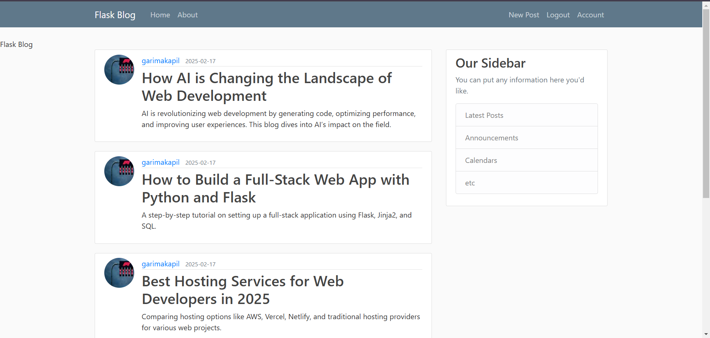
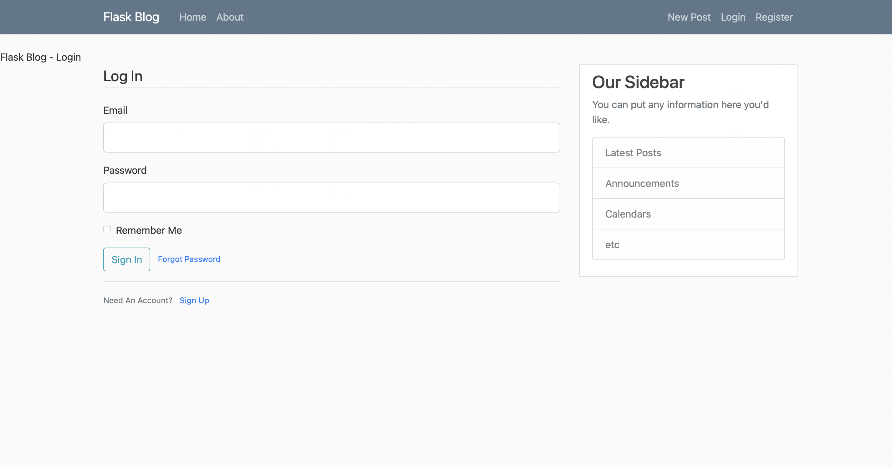
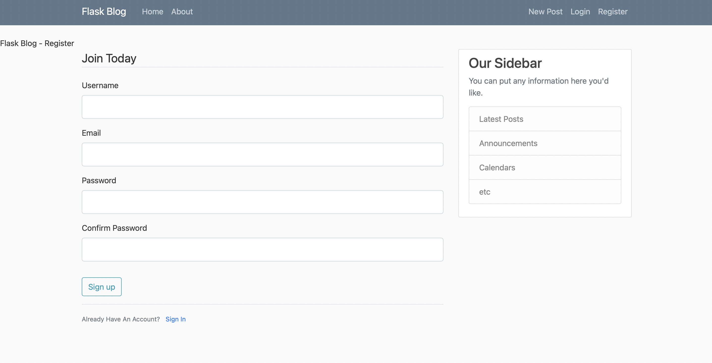
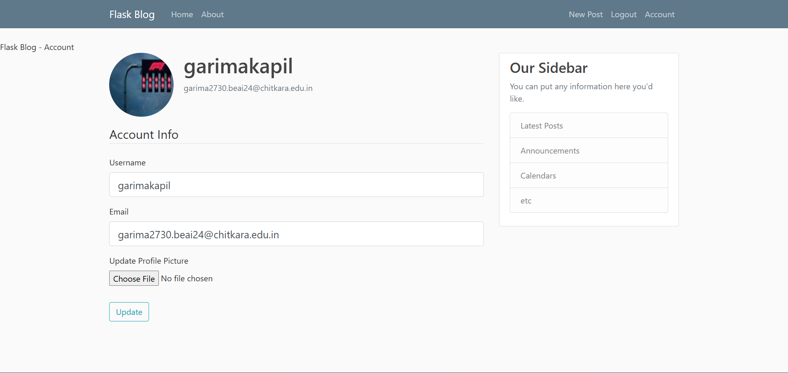

# 📝 Flask Blog

 A full-featured blogging application built with Flask, featuring user authentication, password reset, profile management, pagination, and CRUD functionality for blog posts.

  
 <hr>

 # 🚀 Features

✅ User Authentication (Register, Login, Logout)<br>
✅ Profile Management (Update profile picture & username)<br>
✅ Password Reset via Email<br>
✅ CRUD for Blog Posts (Create, Read, Update, Delete)<br>
✅ Pagination for Posts<br>
✅ User-Specific Post Feed<br>
✅ Secure Password Hashing with Bcrypt<br>
✅ Flask-Mail for Email Notifications<br>

<hr>

# 📂 Project Structure
```
Flask_Blog/
│── flaskblog/
│   ├── __init__.py        # Initialize Flask app & extensions
│   ├── routes.py          # App routes (login, register, posts, etc.)
│   ├── models.py          # Database models (User, Post)
│   ├── forms.py           # Flask-WTF forms for authentication & posts
│   ├── static/            # Static assets (CSS, images)
│   ├── templates/         # HTML templates
│       ├── layout.html    # Main template structure
│       ├── login.html     # User login page
│       ├── register.html  # User registration page
│       ├── post.html      # Individual post page
│       ├── user_post.html # Posts by a specific user
│       ├── reset_request.html  # Request password reset page
│       ├── reset_token.html    # Reset password page
│	├── about.html	   # About page
│	├── account.html   #  User profile page (edit details & change profile picture)
│	├── create_post.html	# Page to create a new blog post
│	├── home.html	   #  Home page displaying blog posts
│	├── main.html	   # Base template extended by other templates
│
│   ├── site.db            # SQLite database (ignored in .gitignore)
│── config.py              # Application configuration (environment variables)
│── run.py                 # Entry point for running the app
│── requirements.txt       # Dependencies
│── screenshots/           # ✅ Screenshots folder for README
│   ├── account.png
│   ├── login.png
│   ├── register.png
│   ├── home.png               
│── .gitignore             # Prevents sensitive files from being committed
│── README.md              # Project documentation
```
<hr>

# ⚡ Installation & Setup

1️⃣ Clone the Repository
``` bash
git clone https://github.com/yourusername/Flask_Blog.git
cd Flask_Blog
```
2️⃣ Create a Virtual Environment
```bash
python -m venv venv
source venv/bin/activate  # On macOS/Linux
venv\Scripts\activate  # On Windows
```
3️⃣ Install Dependencies
```bash
pip install -r requirements.txt
```
4️⃣ Set Up Environment Variables
```bash
SECRET_KEY=your-secret-key
EMAIL_USER=your-email@gmail.com
EMAIL_PASS=your-email-app-password
```
Or set them manually:
```bash
export SECRET_KEY="your-secret-key"
export EMAIL_USER="your-email@gmail.com"
export EMAIL_PASS="your-email-app-password"
```
5️⃣ Initialize the Database
```bash
flask db init
flask db migrate -m "Initial migration"
flask db upgrade
```
6️⃣ Run the Application
```bash
python run.py
```
<hr>

# 📸 Screenshots

### 🔹 Login Page


### 🔹 Register Page


### 🔹 Home Page


### 🔹 Account Page


<hr>

# 🔧 Technologies Used
	•	Flask (Backend Framework)
	•	Flask-SQLAlchemy (ORM for Database)
	•	Flask-WTF (Forms & Validation)
	•	Flask-Mail (Sending Emails)
	•	Flask-Login (User Authentication)
	•	Bcrypt (Password Hashing)
	•	SQLite (Database)
	•	Bootstrap (Frontend Styling)

<hr>

# 🛠 Future Improvements

🔹 Add a comment system <br>
🔹 Implement a like/upvote feature for posts<br>
🔹 Improve UI with a modern CSS framework<br>
🔹 Enable image uploads for posts<br>

<hr>

# 📜 License
This project is licensed under the [MIT License](https://github.com/Goyam02/Flask_Blog/blob/master/LICENSE). You are free to use and modify it as per your needs.

<hr>

# ⭐ Contributing

	1.	Fork the repository
	2.	Create a new branch (git checkout -b feature-branch)
	3.	Commit changes (git commit -m "Added new feature")
	4.	Push to GitHub (git push origin feature-branch)
	5.	Open a Pull Request 🎉

<hr>

# 📬 Contact
👤 Goyam Jain <br>
📧 goyamjain02@gmail.com <br>
🔗 [LinkedIn](https://www.linkedin.com/in/goyam02) <br>

<hr>

# 🌟 If you found this project useful, don’t forget to give it a star! ⭐


